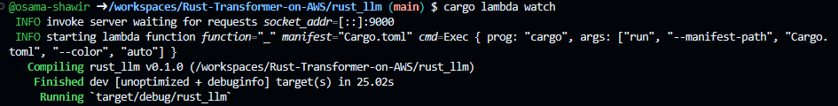
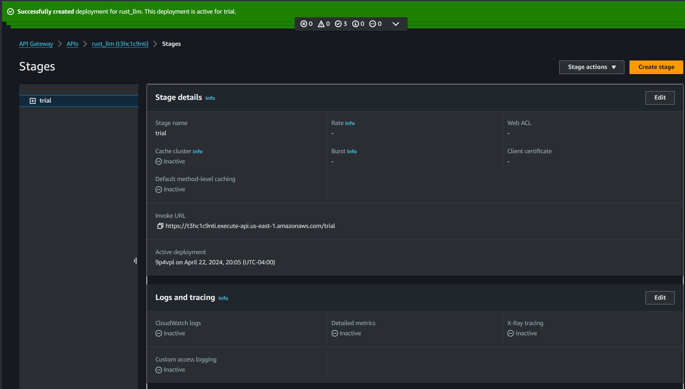
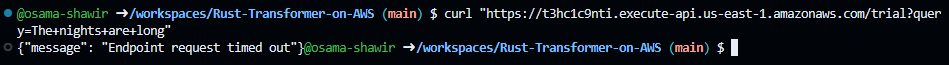
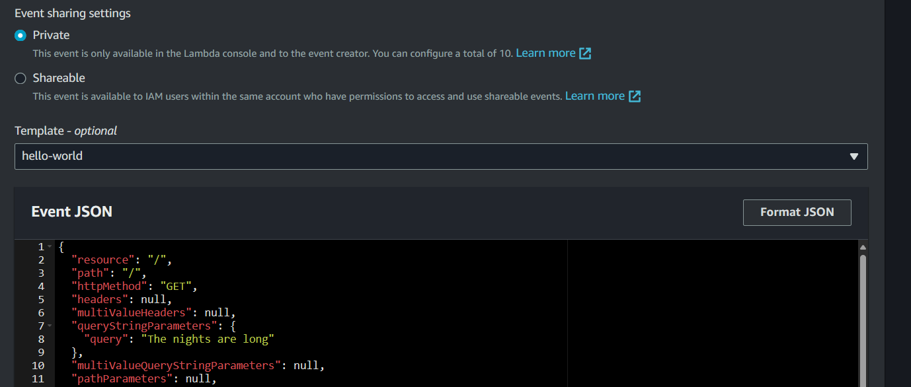
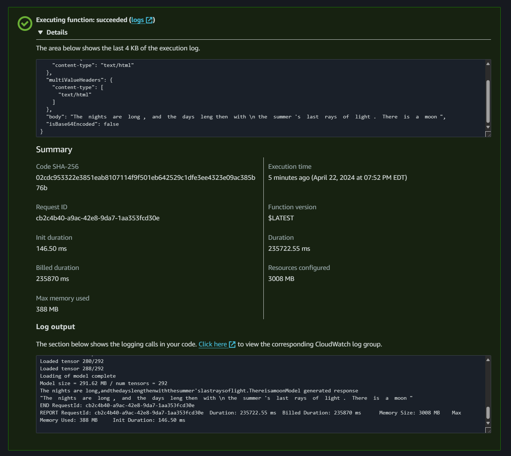
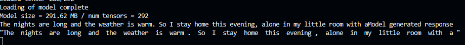
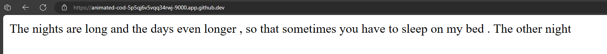

# Rust-Transformer-on-AWS

## Introduction

This project demonstrates how to deploy a Rust-based transformer model on AWS using AWS Lambda and API Gateway. The motivation behind this project is to show that lightweight Rust Language Models (LLMs) can be built into Lambda functions for efficient and scalable text processing tasks.

The specific model we are using is `pythia-410m-q5_1-ggjt.bin` from HuggingFace, which is a transformer model designed for text-based queries.

## Repository Structure

The repository is structured as follows:

```
.
├── Cargo.lock
├── Cargo.toml
├── Dockerfile
├── src
│   ├── main.rs
│   └── pythia-410m-q5_1-ggjt.bin
└── target
    ├── CACHEDIR.TAG
    └── debug
        ├── build
        ├── deps
        ├── examples
        ├── incremental
        ├── rust_llm
        └── rust_llm.d
```

The `src` directory contains the main Rust source code (`main.rs`) and the transformer model (`pythia-410m-q5_1-ggjt.bin`) loaded from HuggingFace. The `target` directory is generated by the Rust compiler and contains the compiled binary and other build artifacts.

## Development and Deployment

During development, we use the `cargo lambda watch` command to automatically build and deploy the model whenever changes are made. This allows for rapid testing and iteration.



Once the model is ready for deployment, we build a Docker image using the provided `Dockerfile`. This image is then pushed to an Amazon Elastic Container Registry (ECR) repository.

From the ECR repository, the Docker image is deployed as a Lambda function. This allows the model to scale automatically based on demand and removes the need for manual server management.

Finally, we expose the Lambda function as a RESTful API using Amazon API Gateway. This allows the model to be easily integrated into other applications and services.



## Challenges and Solutions

One challenge we faced during this project is the maximum timeout of 29 seconds imposed by AWS API Gateway. This means that if the model takes longer than 29 seconds to process a request, the API call will time out before completion.



To overcome this challenge, we can explore various optimization methods to make the model run faster. These include increasing the memory allocation for the Lambda function, optimizing the model code, and using a lighter weight model.

However, there is a trade-off between model size and output quality. A smaller model may run faster, but it may also produce less accurate results. Therefore, the choice of model and optimization methods will depend on the specific requirements of your application.

## Testing

We use a JSON-based event for testing the model. The structure of the event is shown below:



The following image shows the result of executing a test on the deployed model:



## Model Responses

When a query is made to the model, the response is displayed in the terminal as shown below:



The model can also be queried through a browser. The response is displayed as shown in the following screenshot:



## Project Setup

To set up this project on your own AWS account, follow these steps:

1. Clone this repository.
2. Install Rust, Docker, AWS CLI, Cargo Lambda on your local machine.
3. Build the Rust model using the `cargo lambda watch` command to test the model locally.
4. Deploy the model to AWS Lambda through Docker and Amazon ECR.
5. Set up an API Gateway in the AWS Console and connect it to the deployed Lambda function.

## Contributing

Contributions to this project are welcome. Please open an issue or submit a pull request.

## License

This project is licensed under the MIT License.